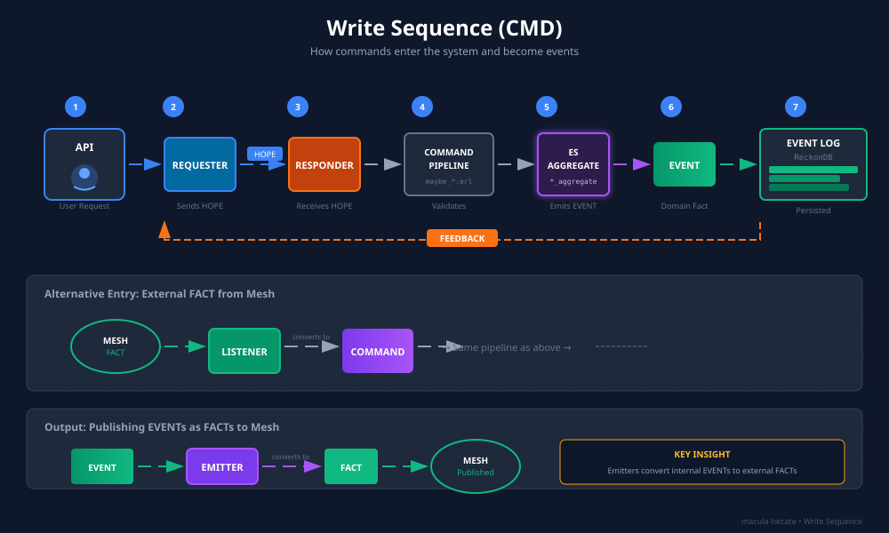
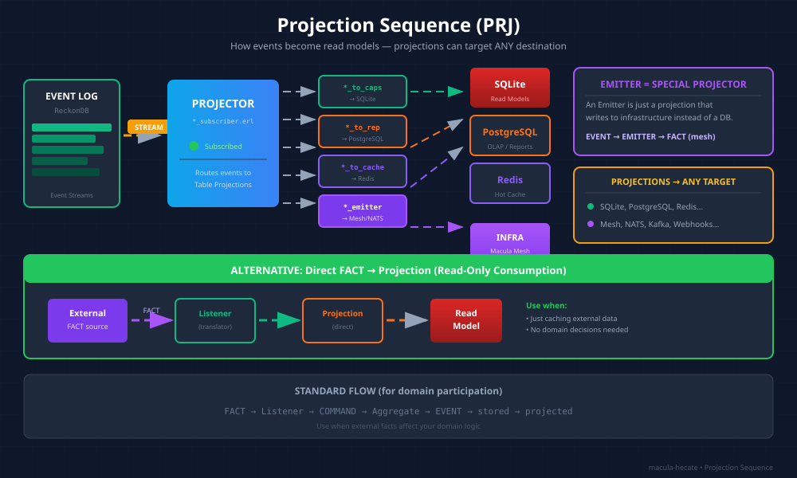
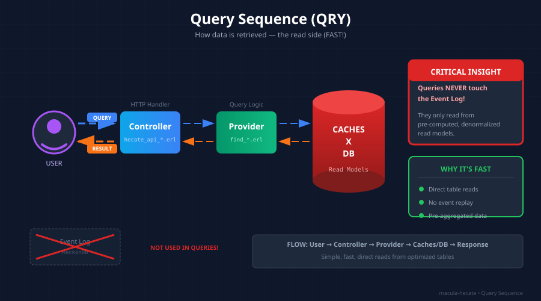
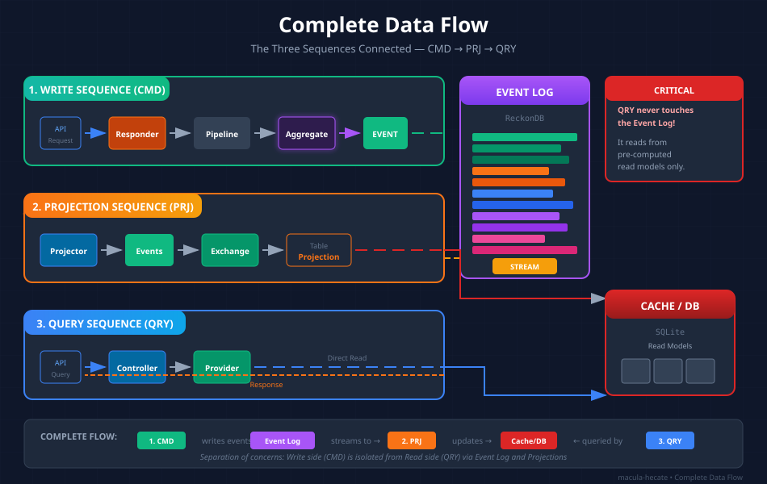

# Hecate daemon Architecture

This document describes the complete architecture of Hecate daemon, a lightweight Erlang daemon for connecting AI agents to the Macula mesh network.

## Table of Contents

- [Overview](#overview)
- [System Architecture](#system-architecture)
- [CQRS/Event Sourcing Pattern](#cqrsevent-sourcing-pattern)
- [Hecate Node Mental Model](#hecate-node-mental-model)
  - [TUI Studios](#tui-studios)
- [Domain Boundaries](#domain-boundaries)
- [Event Flow](#event-flow)
- [Supervision Tree](#supervision-tree)
- [Data Storage](#data-storage)
- [Cartwheel Architecture](#cartwheel-architecture)
  - [The Three Sequences](#the-three-sequences)
- [Mesh Integration](#mesh-integration)
- [Scaling Considerations](#scaling-considerations)

---

## Overview

### Purpose

**Hecate daemon** is a sidecar daemon that:
- Exposes REST API for mesh operations
- Manages agent identity and capabilities
- Handles RPC and pub/sub communication
- Stores events locally for audit and replay
- Publishes integration facts to the mesh

### Design Principles

1. **Event Sourcing** - All state changes captured as events
2. **CQRS** - Separate read and write models
3. **Vertical Slicing** - Organize by business capability, not technical layer
4. **Embedded Storage** - No external database dependencies
5. **Let It Crash** - OTP supervision for fault tolerance

### Key Technologies

- **Erlang/OTP 26+** - Runtime platform
- **ReckonDB** - Embedded event store
- **Evoq** - Event dispatch and command handling
- **SQLite** - Read model storage (via esqlite)
- **Cowboy** - HTTP server
- **Macula** - HTTP/3 mesh client

---

## System Architecture

```
┌─────────────────────────────────────────────────────────────┐
│                      Agent (any runtime)                     │
│                   Python, Go, JavaScript, etc.               │
└───────────────────────────┬─────────────────────────────────┘
                            │ REST API (HTTP)
                            ▼
┌─────────────────────────────────────────────────────────────┐
│                    hecate_api (Cowboy)                       │
│                   Port 4444, HTTP/1.1                        │
└───────────────────────────┬─────────────────────────────────┘
                            │
        ┌───────────────────┼───────────────────┐
        │                   │                   │
        ▼                   ▼                   ▼
┌───────────────┐   ┌───────────────┐   ┌──────────────┐
│   Command     │   │    Query      │   │    Mesh      │
│   Services    │   │   Services    │   │  Publisher   │
│  (6 domains)  │   │  (6 domains)  │   │              │
└───────┬───────┘   └───────▲───────┘   └──────┬───────┘
        │                   │                   │
        ▼                   │                   │
┌───────────────┐           │                   │
│   ReckonDB    │───────────┘                   │
│ (event store) │   Events (subscription)       │
└───────────────┘                               │
                                                ▼
                                        ┌────────────────┐
                                        │  Macula Mesh   │
                                        │  (HTTP/3 DHT)  │
                                        └────────────────┘
```

### Components

| Component | Responsibility |
|-----------|----------------|
| **hecate_api** | REST API endpoints, request routing |
| **Command Services** | Handle commands, validate, emit events |
| **Query Services** | Project events into read models, serve queries |
| **ReckonDB** | Store events, provide event streams |
| **Mesh Publisher** | Publish integration facts to DHT |
| **Macula Mesh** | HTTP/3 transport, DHT, pub/sub, RPC |

---

## CQRS/Event Sourcing Pattern

### Command Side (Write Model)

```
HTTP POST /capabilities/announce
        │
        ▼
┌────────────────────────────────┐
│  announce_capability_v1.erl    │ ◄─ Command (immutable)
│  (command module)              │
└────────────────┬───────────────┘
                 │
                 ▼
┌────────────────────────────────┐
│  maybe_announce_capability.erl │ ◄─ Handler (business logic)
│  (handler module)              │
│  - Validate command            │
│  - Check business rules        │
│  - Return events               │
└────────────────┬───────────────┘
                 │
                 ▼
┌────────────────────────────────┐
│  capability_announced_v1.erl   │ ◄─ Event (fact, immutable)
│  (event module)                │
└────────────────┬───────────────┘
                 │
                 ▼
┌────────────────────────────────┐
│  ReckonDB (event store)        │ ◄─ Persistent storage
│  - Append-only log             │
│  - Stream per aggregate        │
└────────────────────────────────┘
```

### Query Side (Read Model)

```
ReckonDB Event Stream
        │
        ▼
┌────────────────────────────────┐
│  Subscriber (gen_server)       │ ◄─ Event subscription
│  - Polls for new events        │
│  - Dispatches to projections   │
└────────────────┬───────────────┘
                 │
                 ▼
┌────────────────────────────────┐
│  capability_announced_v1_      │ ◄─ Projection (transforms event)
│  to_capabilities.erl           │
│  - Extract data from event     │
│  - Update SQLite read model    │
└────────────────┬───────────────┘
                 │
                 ▼
┌────────────────────────────────┐
│  SQLite (read model)           │ ◄─ Optimized for queries
│  - Denormalized tables         │
│  - Indexes on query fields     │
└────────────────┬───────────────┘
                 │
                 ▼
┌────────────────────────────────┐
│  find_capability.erl           │ ◄─ Query (read from SQLite)
│  list_capabilities.erl         │
└────────────────────────────────┘
                 │
                 ▼
        HTTP GET /capabilities/discover
```

### Key Concepts

**Commands** - Represent intent to change state
- Named with present-tense verbs: `announce_capability_v1`
- Include all data needed for validation
- May be rejected if business rules violated

**Events** - Represent facts that occurred
- Named with past-tense verbs: `capability_announced_v1`
- Immutable once stored
- Source of truth for all state

**Aggregates** - Consistency boundaries
- Load from event stream
- Validate commands
- Emit events
- Keep minimal state in memory

**Projections** - Transform events into read models
- Run asynchronously
- Eventually consistent
- Can be rebuilt from events

**Read Models** - Optimized for queries
- Denormalized (no joins)
- Indexed on query patterns
- Separate per domain

---

## Hecate Node Mental Model

A **hecate node** is one of:
- A standalone k3s node (server+agent) running a single `hecate-daemon`
- A multi-node k3s cluster where each node runs a `hecate-daemon` — the cluster shares one certificate, presenting itself to the mesh as a single identity

A hecate node can host multiple **ventures**. Two ventures are built-in:

### 1. `craft_ventures` (User-Facing)

The AI-guided venture lifecycle system. This is the product — it helps developers build software through a structured, AI-supported process.

**10 processes:** `setup_venture` → `discover_divisions` → `design_division` → `plan_division` → `generate_division` → `test_division` → `deploy_division` → `monitor_division` → `rescue_division`, orchestrated by `guide_venture`.

Each process follows the venture lifecycle protocol (pending → active → paused → completed). See `hecate-agents/philosophy/HECATE_VENTURE_LIFECYCLE.md` for full details.

### 2. `operate_hecate_node` (Infrastructure)

The always-running infrastructure that makes a hecate node functional on the mesh. Currently implemented as separate `manage_*` and `query_*` apps, these handle:

| Concern | CMD App | QRY App | What It Does |
|---------|---------|---------|-------------|
| Identity | `manage_identities` | `query_identities` | Who this node is on the mesh |
| Capabilities | `manage_capabilities` | `query_capabilities` | What this node can do |
| Social | `manage_social` | `query_social` | Who this node follows/endorses |
| Subscriptions | `manage_subscriptions` | `query_subscriptions` | What topics this node cares about |
| Reputation | `manage_reputation` | `query_reputation` | Trust scoring for RPC interactions |
| UCAN | `manage_ucan` | `query_ucan` | Capability delegation tokens |
| Connectors | `manage_connectors` | — | How sidecar agents connect |
| LLM | `serve_llm` | — | AI model access |

These are **not** venture lifecycle processes — they don't follow the 10-process ALC. They are node-level operations that run continuously.

> **Future:** When the venture framework matures, these may be restructured into a formal `operate_hecate_node` venture with its own divisions. For now, the separate app structure works and ships.

### TUI Studios

The TUI presents hecate node functionality through **Studios** — self-contained workspaces, each with its own state, views, and commands. Studios are a UX concept; they don't map 1:1 to daemon apps.

**v1 Built-In Studios:**

| Studio | Purpose | Daemon Backend |
|--------|---------|----------------|
| **LLM Studio** | Free-form AI chat, model selection, tools | `serve_llm` |
| **Development Studio** | AI-guided venture lifecycle (all 10 processes) | `craft_ventures` apps |
| **DevOps Studio** | Node health, providers, capabilities, connectors, agent social | `operate_hecate_node` apps |
| **Social Studio** | Profile, IRC-style chat channels | New (human social over mesh pub/sub) |

**Two types of social:**
- **Human Social** (Social Studio) — People talking to people. IRC chat, profiles, feeds. Drives viral adoption.
- **Agent Social** (DevOps Studio) — Agents discovering and trusting each other. Follow, endorse, reputation. Infrastructure.

**Studio Switcher UX:**
- **First launch:** Home screen showing all 4 studios as cards (communicates breadth)
- **During use:** Top bar with studio tabs (Ctrl+1-4 to switch, or `/studio` command)
- **State preservation:** Each studio preserves its state when switching away and back
- **Future:** Studio Explorer for downloading third-party studio plugins from the mesh

> **Design principle:** Studios share the LLM — you can chat contextually within any studio. The AI adapts its persona and knowledge based on which studio is active.

---

## Domain Boundaries

The node operations are organized into bounded contexts:

### 1. Capabilities (`manage_capabilities` / `query_capabilities`)

**Purpose:** Announce and discover agent capabilities on the mesh.

**Commands:**
- `announce_capability_v1` - Announce a new capability

**Events:**
- `capability_announced_v1` - Capability was announced

**Queries:**
- `find_capability` - Find by MRI
- `list_capabilities` - Discover with filters (realm, tags)

**Read Model:** `capabilities` table (MRI, agent, tags, description)

### 2. Reputation (`manage_reputation` / `query_reputation`)

**Purpose:** Track RPC call outcomes for reputation scoring.

**Commands:**
- `track_rpc_call_v1` - Record RPC call result

**Events:**
- `rpc_call_tracked_v1` - Call outcome recorded

**Queries:**
- `get_reputation` - Get reputation score for agent
- `get_call_history` - Get call history

**Read Model:** `reputation` table (agent, success_count, failure_count, score)

### 3. Social Graph (`manage_social` / `query_social`)

**Purpose:** Manage agent-to-agent following relationships.

**Commands:**
- `follow_agent_v1` - Follow another agent

**Events:**
- `agent_followed_v1` - Agent was followed

**Queries:**
- `get_followers` - List followers
- `get_following` - List following

**Read Model:** `social_graph` table (follower, followee, followed_at)

### 4. Subscriptions (`manage_subscriptions` / `query_subscriptions`)

**Purpose:** Subscribe to services on the mesh.

**Commands:**
- `subscribe_v1` - Subscribe to service
- `unsubscribe_v1` - Unsubscribe from service

**Events:**
- `subscribed_v1` - Subscription created
- `unsubscribed_v1` - Subscription removed

**Queries:**
- `get_subscriptions` - List active subscriptions

**Read Model:** `subscriptions` table (service_mri, subscribed_at, metadata)

### 5. Identities (`manage_identities` / `query_identities`)

**Purpose:** Register and manage agent identities.

**Commands:**
- `register_identity_v1` - Register new identity

**Events:**
- `identity_registered_v1` - Identity was registered

**Queries:**
- `find_identity` - Get identity details

**Read Model:** `identities` table (identity_mri, public_key, created_at)

### 6. UCAN (`manage_ucan` / `query_ucan`)

**Purpose:** Grant and revoke capabilities via UCAN tokens.

**Commands:**
- `grant_capability_v1` - Grant capability to agent
- `revoke_capability_v1` - Revoke capability

**Events:**
- `capability_granted_v1` - Capability was granted
- `capability_revoked_v1` - Capability was revoked

**Queries:**
- `find_capabilities` - Find by audience or issuer

**Read Model:** `ucan_capabilities` table (token_id, audience, capability, expires_at)

---

## Event Flow

### Complete Flow Example: Announce Capability

```
1. HTTP Request
   POST /capabilities/announce
   Body: {capability_mri, tags, description, ...}

2. API Handler (hecate_api_capabilities.erl)
   - Parse JSON
   - Build command: announce_capability_v1:new(...)
   - Call handler

3. Handler (maybe_announce_capability.erl)
   - Load aggregate from event stream
   - Validate business rules
   - Return events: [capability_announced_v1]

4. Dispatch (via reckon_evoq)
   - Wrap in evoq_event envelope
   - Append to ReckonDB
   - Return {ok, Version, Events}

5. Event Storage (ReckonDB)
   - Persist to disk
   - Add to stream: "capability-{mri}"
   - Trigger subscribers

6. Query Projection (capability_announced_v1_to_capabilities.erl)
   - Subscriber receives event
   - Extract data
   - INSERT into SQLite

7. Mesh Projection (capability_announced_v1_to_mesh.erl)
   - Subscriber receives event
   - Publish to mesh via hecate_mesh_publisher
   - DHT now knows about capability

8. HTTP Response
   200 OK
   Body: {ok: true, result: {version: 0, event_id: "..."}}
```

### Event Envelope Structure

All events wrapped in `evoq_event` record:

```erlang
#evoq_event{
    event_id = <<"evt-abc123">>,
    event_type = <<"capability_announced_v1">>,
    stream_id = <<"capability-mri:capability:io.macula/weather">>,
    version = 0,
    data = #{
        capability_mri => <<"mri:capability:io.macula/weather">>,
        agent_identity => <<"mri:agent:io.macula/my-agent">>,
        tags => [<<"weather">>],
        description => <<"Weather service">>,
        demo_procedure => null,
        metadata => #{}
    },
    metadata = #{
        correlation_id => <<"req-abc">>,
        causation_id => <<"cmd-xyz">>,
        user_id => <<"mri:agent:io.macula/my-agent">>
    },
    tags = [<<"realm:io.macula">>],
    timestamp = 1706745600000,
    epoch_us = 1706745600000000
}.
```

---

## Supervision Tree

```
hecate_sup (one_for_one)
│
├─ manage_capabilities_sup (one_for_one)
│  ├─ reckon_db (worker) [manage_capabilities_db]
│  └─ capability_announced_v1_to_mesh (worker)
│
├─ query_capabilities_sup (one_for_one)
│  ├─ query_capabilities_store (worker) [SQLite]
│  └─ query_capabilities_subscriber (worker)
│
├─ manage_reputation_sup (...)
├─ query_reputation_sup (...)
├─ manage_social_sup (...)
├─ query_social_sup (...)
├─ manage_subscriptions_sup (...)
├─ query_subscriptions_sup (...)
├─ manage_identities_sup (...)
├─ query_identities_sup (...)
├─ manage_ucan_sup (...)
├─ query_ucan_sup (...)
│
├─ hecate_mesh (worker)
│  └─ Macula mesh client (HTTP/3 connection)
│
└─ hecate_api_sup (rest_for_one)
   └─ cowboy_http_listener (worker)
```

### Restart Strategies

**Command Services:** `one_for_one`
- If ReckonDB crashes, restart only ReckonDB
- Mesh publisher is independent

**Query Services:** `one_for_one`
- If subscriber crashes, restart only subscriber
- SQLite store is independent

**API:** `rest_for_one`
- If Cowboy crashes, restart all HTTP components

### Failure Scenarios

**ReckonDB Failure:**
- Restart ReckonDB worker
- Replay events on startup (event sourcing advantage)
- Commands queue until ready

**Subscriber Failure:**
- Restart subscriber
- Resume from last acknowledged event
- Projection lag temporarily increases

**SQLite Failure:**
- Restart store worker
- Rebuild from events (all events still in ReckonDB)
- Queries return errors until rebuilt

**Mesh Failure:**
- Restart hecate_mesh worker
- Reconnect to bootstrap nodes
- Re-register procedures and subscriptions

---

## Data Storage

### ReckonDB (Event Store)

**Location:** `~/.hecate/reckondb/`

**Structure:**
- One embedded instance per command service
- Append-only log per aggregate stream
- Fsync on every write (durability)

**Streams:**
- `capability-{mri}` - Capability announcements
- `agent-{identity}` - Agent social graph
- `subscription-{mri}` - Service subscriptions
- `identity-{mri}` - Identity registrations
- `ucan-{token_id}` - UCAN grants/revocations
- `reputation-{agent}` - RPC call tracking

**Configuration:**
```erlang
#{
    name => manage_capabilities_db,
    data_dir => "~/.hecate/reckondb/capabilities",
    fsync => true,
    batch_size => 1  % No batching by default
}
```

### SQLite (Read Models)

**Location:** `~/.hecate/query_{domain}.db`

**One database per query service:**
- `query_capabilities.db`
- `query_reputation.db`
- `query_social.db`
- `query_subscriptions.db`
- `query_identities.db`
- `query_ucan.db`

**Schema Example (capabilities):**

```sql
CREATE TABLE capabilities (
    mri TEXT PRIMARY KEY,
    agent_identity TEXT NOT NULL,
    tags TEXT NOT NULL,  -- JSON array
    description TEXT NOT NULL,
    demo_procedure TEXT,
    metadata TEXT,  -- JSON object
    announced_at INTEGER NOT NULL
);

CREATE INDEX idx_capabilities_realm ON capabilities(substr(mri, 1, instr(mri, '/') - 1));
CREATE INDEX idx_capabilities_tags ON capabilities(tags);  -- JSON search
```

**Journal Mode:** DELETE (default), WAL (production)

**Synchronous:** FULL (default), NORMAL (production)

---

## Cartwheel Architecture

The Cartwheel Architecture (from DisComCo - "Majestic Modularity") provides the conceptual foundation for how hecate organizes code and integrates with the mesh.

> **Educational Guides:** For in-depth understanding of each sequence, see:
> - [Cartwheel Overview](../guides/CARTWHEEL_OVERVIEW.md) — The wheel metaphor and core principles
> - [Write Sequence (CMD)](../guides/CARTWHEEL_WRITE_SEQUENCE.md) — How commands enter and become events
> - [Projection Sequence (PRJ)](../guides/CARTWHEEL_PROJECTION_SEQUENCE.md) — How events become read models
> - [Query Sequence (QRY)](../guides/CARTWHEEL_QUERY_SEQUENCE.md) — How data is retrieved



### Core Concept: The Wheel

The architecture visualizes a system as a wheel:

- **Hub (Center)**: Aggregate State - the core domain model
- **Spokes**: Vertical slices - each spoke is a business capability
- **Outer Ring**: Integration infrastructure - storage, messaging, telemetry, etc.

### Key Principles

| Principle | Description |
|-----------|-------------|
| **Spokes = Vertical Slices** | Each spoke is a unit of cohesion, containing all code for one capability |
| **Spoke Defined by Command** | A spoke is identified by the command it processes (e.g., `announce_capability/`) |
| **Spokes "Scream" Intent** | Directory and module names immediately reveal business purpose |
| **Decoupling via Exchange** | Integration infrastructure sits on the outer ring, not inside spokes |
| **Unit of Deployment** | Each spoke can be deployed and scaled independently |
| **Compatible with DDD/ES/CQRS** | Works naturally with Domain-Driven Design, Event Sourcing, and Actor Model |

### Integration Infrastructure

The outer ring provides infrastructure services that spokes connect to:

- **Storage**: ReckonDB (event store), SQLite (read models)
- **Event Log**: Immutable record of all domain events
- **Messaging**: Mesh pub/sub for inter-agent communication
- **Telemetry**: Metrics, logging, tracing
- **Caching**: Read model optimization
- **Internet**: External API access
- **Hardware**: Device access, sensors, actuators

### Mesh Integration Components

**CRITICAL: FACTS ≠ EVENTS**

The mesh carries integration messages (FACTS/HOPES/FEEDBACKS), NOT internal domain events.

| Component | Purpose | Flow |
|-----------|---------|------|
| **Emitter** | Publishes to mesh | Domain EVENT → converts to → FACT → Mesh |
| **Listener** | Receives from mesh | Mesh FACT → converts to → COMMAND → Aggregate |
| **Requester** | Initiates RPC | Sends HOPE → receives FEEDBACK |
| **Responder** | Handles RPC | Receives HOPE → COMMAND → Aggregate → FEEDBACK |

### Message Types

| Type | Tense | Purpose | Example |
|------|-------|---------|---------|
| **FACT** | Past | Something happened (published) | `capability.available`, `agent.joined` |
| **HOPE** | Present | Request (optimistic) | `capability.announce`, `rpc.call` |
| **FEEDBACK** | Result | Response to HOPE | Success/failure response |
| **EVENT** | Past | Internal domain event | `capability_announced_v1` (stored in ReckonDB) |
| **COMMAND** | Imperative | Intention to change state | `announce_capability_v1` |

### Correct Integration Flow

**Publishing to Mesh (Emitter Pattern):**
```
Domain EVENT (stored in ReckonDB)
    ↓
Emitter (converts EVENT to FACT)
    ↓
FACT published to Mesh topic
    ↓
Other agents receive FACT
```

**Receiving from Mesh (Listener Pattern):**
```
Mesh FACT received
    ↓
Listener (converts FACT to COMMAND)
    ↓
COMMAND dispatched to Aggregate
    ↓
Domain EVENT generated and stored
    ↓
Projections update read models
```

**RPC Pattern (Requester/Responder):**
```
Requester (Agent A)           Responder (Agent B)
    │                              │
    │──── HOPE ───────────────────>│
    │     (present tense request)  │
    │                              ├── Convert to COMMAND
    │                              ├── Dispatch to Aggregate
    │                              ├── Generate result
    │<─── FEEDBACK ────────────────│
    │     (response)               │
```

### Anti-Patterns to Avoid

| Anti-Pattern | Why It's Wrong | Correct Approach |
|--------------|----------------|------------------|
| Publishing domain EVENTs directly to mesh | Leaks internal implementation | Use Emitter to convert EVENT → FACT |
| Mesh subscriber → projection directly | Bypasses aggregate/command flow | Use Listener → COMMAND → Aggregate* |
| Central dispatcher for all events | God-module, violates vertical slicing | Each domain handles its own integration |
| Treating FACTS as EVENTS | Different semantics and lifecycle | FACT is external contract, EVENT is internal |

*\*Exception: For read-only consumption (caching/mirroring external data without domain participation), direct FACT → Projection is acceptable. Use the full CMD flow only when external data affects your aggregate state or domain decisions. See [Projection Sequence Guide](../guides/CARTWHEEL_PROJECTION_SEQUENCE.md#alternative-direct-fact--projection).*

### The Three Sequences

The Cartwheel Architecture defines three fundamental sequences that handle all data flow:

#### 1. Write Sequence (CMD)

The command/write side - how changes enter the system.



**Flow:**
```
API Request → Requester → HOPE → Responder → Command Pipeline → ES Aggregate → Event → Event Log
                                                                                         ↓
                                                                                   Exchange/Emitter
                                                                                         ↓
                                                                              Integration Infrastructure
```

**Components:**

| Component | Purpose | In Hecate |
|-----------|---------|-----------|
| **Requester** (green) | Initiates RPC calls, sends HOPE | `hecate_rpc:call/3` |
| **Responder** (orange) | Handles incoming HOPEs, returns FEEDBACK | `*_responder.erl` |
| **Command Pipeline** | Validates and routes commands | `maybe_*.erl` handlers |
| **ES Aggregate** | Event-sourced aggregate state | `*_aggregate.erl` |
| **Event Log** | Immutable append-only event store | ReckonDB |
| **Emitter** | Converts EVENT → FACT for mesh publication | `*_emitter.erl` |
| **Receiver** | Receives FACTs from mesh, converts to COMMAND | `*_listener.erl` |

**Key insight:** The bottom flow shows how external FACTs from the mesh are received by Receivers, converted to Commands, and processed through the same aggregate flow as local commands.

#### 2. Projection Sequence (PRJ)

How events become read models - the projection/materialization side.



**Flow:**
```
Event Log → Stream → Projector → Events → Exchange → Table Projections → Caches/DB
```

**Components:**

| Component | Purpose | In Hecate |
|-----------|---------|-----------|
| **Projector** (blue bar) | Subscribes to event streams | `query_*_subscriber.erl` |
| **Stream** | Event subscription from log | ReckonDB subscription |
| **Exchange** | Routes events to multiple projections | Event dispatch |
| **Table Projection** | Transforms event → database row | `*_to_*.erl` modules |
| **Caches X DB** | Read model storage | SQLite databases |

**Key insight:** One Projector can feed multiple Table Projections. Each projection creates a different read model optimized for specific query patterns. The same event can update multiple tables.

#### 3. Query Sequence (QRY)

The query/read side - how data is retrieved.



**Flow:**
```
User Query → Controller → Query → Provider → Caches/DB → Response
```

**Components:**

| Component | Purpose | In Hecate |
|-----------|---------|-----------|
| **Controller** (blue) | Receives and validates queries | `hecate_api_*.erl` GET handlers |
| **Provider** (green) | Executes query business logic | `find_*.erl`, `list_*.erl` |
| **Caches X DB** | Pre-computed, denormalized read models | SQLite tables |

**Key insight:** Queries **NEVER touch the Event Log**. They only read from pre-computed, denormalized read models. This is what makes queries fast - no event replay, no joins, just direct reads from optimized tables.

### Complete Data Flow



### Mapping to Hecate

| Sequence | Responsibility | Data Store | Example Files |
|----------|---------------|------------|---------------|
| **Write (CMD)** | Accept commands, validate, emit events | ReckonDB | `maybe_announce_capability.erl` |
| **Projection (PRJ)** | Transform events into read models | ReckonDB → SQLite | `capability_announced_v1_to_capabilities.erl` |
| **Query (QRY)** | Serve fast reads from read models | SQLite only | `find_capability.erl` |

---

## Mesh Integration

### Macula Mesh Client

**Connection:**
- HTTP/3 (QUIC) transport
- Bootstrap: `boot.macula.io:4433`
- Realm: `io.macula` (configurable)

**Operations:**
- **RPC**: Call remote procedures, register local procedures
- **Pub/Sub**: Subscribe to topics, publish messages
- **DHT**: Store and retrieve integration facts

### Integration Facts

**Published to Mesh (via Emitters):**
- `capability_announced_v1` → FACT: `capability.available`
- `identity_registered_v1` → FACT: `identity.registered`
- `agent_followed_v1` → FACT: `social.followed`
- `subscribed_v1` → FACT: `subscription.created`

**NOT Published:**
- `rpc_call_tracked_v1` (internal reputation only)
- `capability_granted_v1` (UCAN tokens, not public)
- `capability_revoked_v1` (UCAN revocations, not public)

### Mesh Integration Modules

Each domain should have proper integration components:

```erlang
%% Emitter: Converts domain events to mesh facts
%% apps/manage_capabilities/src/capability_announced_v1_emitter.erl
-module(capability_announced_v1_emitter).
-behaviour(gen_server).

init([]) ->
    {ok, SubId} = reckon_evoq_adapter:subscribe(
        manage_capabilities_db,
        event_type,
        <<"capability_announced_v1">>,
        <<"emitter_capability_announced">>,
        #{start_from => 0, subscriber_pid => self()}
    ),
    {ok, #state{subscription_id = SubId}}.

handle_info({event, #evoq_event{data = EventData}}, State) ->
    %% Convert domain event to mesh fact
    Fact = event_to_fact(EventData),
    hecate_mesh:publish(<<"hecate.capability.available">>, Fact),
    reckon_evoq_adapter:ack(State#state.subscription_id),
    {noreply, State}.

event_to_fact(EventData) ->
    %% Transform internal event structure to public fact contract
    #{
        capability_mri => maps:get(capability_mri, EventData),
        agent_identity => maps:get(agent_identity, EventData),
        description => maps:get(description, EventData),
        available_at => erlang:system_time(millisecond)
    }.
```

```erlang
%% Listener: Converts mesh facts to commands
%% apps/manage_capabilities/src/capability_available_listener.erl
-module(capability_available_listener).
-behaviour(gen_server).

init([]) ->
    hecate_mesh:subscribe(<<"hecate.capability.available">>, self()),
    {ok, #state{}}.

handle_info({mesh_fact, _Topic, Fact}, State) ->
    %% Convert mesh fact to domain command
    Cmd = fact_to_command(Fact),
    %% Dispatch to aggregate (goes through normal CQRS flow)
    maybe_record_remote_capability:dispatch(Cmd),
    {noreply, State}.

fact_to_command(Fact) ->
    record_remote_capability_v1:new(
        maps:get(capability_mri, Fact),
        maps:get(agent_identity, Fact),
        maps:get(description, Fact)
    ).
```

---

## Scaling Considerations

### Vertical Scaling

**Single-node limits:**
- ReckonDB: ~1000 commands/sec (disk bound)
- SQLite: ~10,000 queries/sec (memory bound)
- Cowboy: ~10,000 concurrent connections

**Scale up:**
- Faster disk (NVMe) for ReckonDB
- More RAM for SQLite caching
- More CPU cores (Erlang schedulers)

### Horizontal Scaling

**Current limitations:**
- All command services on one node
- ReckonDB is embedded (not distributed)
- No aggregate sharding

**Future:**
- Shard command services by aggregate ID range
- Distributed ReckonDB cluster
- Multiple query service replicas (read scaling)

### Read Scaling

**Query services can scale independently:**

```
Command Service (single node)
        ↓
    ReckonDB
        ↓
   Event Stream
     ↙   ↓   ↘
Query1  Query2  Query3  (multiple nodes)
  ↓       ↓       ↓
SQLite1 SQLite2 SQLite3  (separate read models)
```

Benefits:
- Geographic distribution (low latency)
- Specialized indexes (different query patterns)
- Read load distribution

---

## Performance Characteristics

See `docs/PERFORMANCE.md` for detailed performance analysis.

**Targets:**
- Command throughput: > 500 ops/sec
- Query latency (P95): < 10ms
- Projection lag (P95): < 100ms
- Startup time: < 5 seconds
- Memory per aggregate: < 10MB

---

## Security Considerations

### Current

- **No authentication** - Daemon listens on localhost only
- **Trusted localhost** - Any local process can call API
- **UCAN validation** - Tokens validated before use

### Future

- **JWT authentication** - For remote API access
- **Rate limiting** - Per-endpoint limits
- **TLS** - For remote connections
- **API keys** - For multi-tenant scenarios

---

## Deployment Patterns

### 1. Local Development

```bash
# Start daemon
hecate start

# Agent connects
curl http://localhost:4444/...
```

### 2. Docker Sidecar

```yaml
services:
  agent:
    image: my-agent:latest
    environment:
      HECATE_URL: http://hecate:4444

  hecate:
    image: macula/hecate:latest
    ports:
      - "127.0.0.1:4444:4444"
```

### 3. Kubernetes Sidecar

```yaml
apiVersion: v1
kind: Pod
metadata:
  name: agent-pod
spec:
  containers:
    - name: agent
      image: my-agent:latest
      env:
        - name: HECATE_URL
          value: http://localhost:4444

    - name: hecate
      image: macula/hecate:latest
      ports:
        - containerPort: 4444
          protocol: TCP
```

### 4. Systemd Service

```ini
[Unit]
Description=Macula Hecate Daemon
After=network.target

[Service]
Type=forking
User=hecate
ExecStart=/usr/local/bin/hecate start
ExecStop=/usr/local/bin/hecate stop
Restart=on-failure

[Install]
WantedBy=multi-user.target
```

---

## Monitoring and Observability

### Logs

**Default:** `~/.hecate/logs/hecate.log`

**Log Levels:**
- `error` - Failures requiring attention
- `warning` - Potential issues
- `info` - Normal operations (default)
- `debug` - Detailed troubleshooting

**Key Events:**
- Command dispatched
- Event stored
- Projection updated
- Mesh operation (RPC, pub/sub)

### Metrics

**Future: Prometheus endpoint** `/metrics`

Metrics to expose:
- `hecate_commands_total{domain}` - Commands by domain
- `hecate_events_total{type}` - Events by type
- `hecate_projection_lag_ms{domain}` - Projection lag
- `hecate_rpc_calls_total{status}` - RPC calls (success/failure)
- `hecate_pubsub_messages_total{topic}` - Pub/sub messages

### Health Checks

**Endpoint:** `GET /health`

**Checks:**
- ReckonDB connectivity
- SQLite accessibility
- Mesh connection status
- Projection lag < threshold

---

## Testing Strategy

See `test/performance/README.md` for performance tests.

**Unit Tests:**
- Command validation
- Event serialization
- Projection logic
- Query functions

**Integration Tests:**
- API endpoints
- Event flow (command → event → projection → query)
- Mesh publishing

**Performance Tests:**
- Command throughput
- Concurrent read/write
- Large streams
- Projection lag

---

## Future Enhancements

- [ ] WebSocket API for real-time events
- [ ] Snapshots for large aggregates
- [ ] Event archival (cold storage)
- [ ] Distributed ReckonDB cluster
- [ ] Read-through cache for queries
- [ ] GraphQL API
- [ ] Admin UI (Phoenix LiveView)
- [ ] Prometheus metrics
- [ ] OpenTelemetry tracing
- [ ] Circuit breaker for external calls

---

## References

- ReckonDB: https://hexdocs.pm/reckon_db
- Evoq: https://hexdocs.pm/evoq
- Macula: https://hexdocs.pm/macula
- CQRS: https://martinfowler.com/bliki/CQRS.html
- Event Sourcing: https://martinfowler.com/eaaDev/EventSourcing.html
