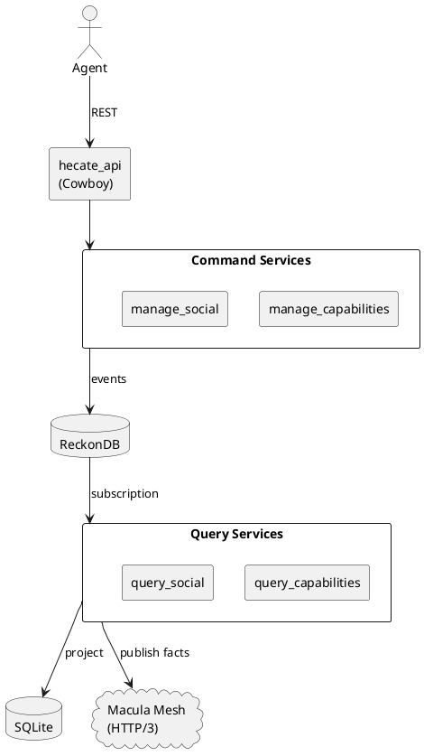
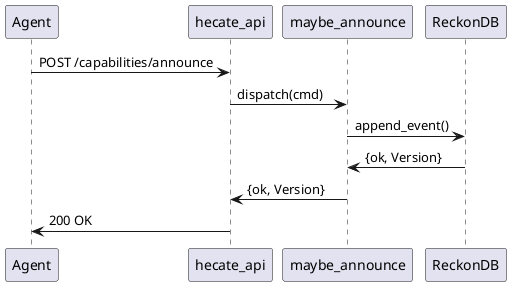

# SVG Diagrams Needed

This document lists the diagrams that should be created as SVGs for the documentation.

## Priority 1: Essential Diagrams

### 1. System Architecture Overview
**File:** `assets/architecture-overview.svg`

**Content:**
- Agent (Python/Go/JS) box at top
- REST API layer (Cowboy, port 4444)
- Command Services (6 domains) with ReckonDB
- Query Services (6 domains) with SQLite
- Mesh Publisher connecting to Macula Mesh (HTTP/3)
- Arrows showing data flow

**Referenced in:** `docs/ARCHITECTURE.md`, `README.md`

### 2. CQRS Event Flow
**File:** `assets/cqrs-event-flow.svg`

**Content:**
- HTTP POST /capabilities/announce
- ↓ announce_capability_v1 (command)
- ↓ maybe_announce_capability (handler)
- ↓ capability_announced_v1 (event)
- ↓ ReckonDB (append to stream)
- ↓ Split into two paths:
  - → Query projection → SQLite → HTTP GET query
  - → Mesh projection → Macula DHT

**Referenced in:** `docs/ARCHITECTURE.md`, `README.md`

### 3. Supervision Tree
**File:** `assets/supervision-tree.svg`

**Content:**
- hecate_sup (root, one_for_one)
- ├─ manage_capabilities_sup
- │  ├─ reckon_db [manage_capabilities_db]
- │  └─ capability_announced_v1_to_mesh
- ├─ query_capabilities_sup
- │  ├─ query_capabilities_store (SQLite)
- │  └─ query_capabilities_subscriber
- ├─ (5 more domain pairs)
- ├─ hecate_mesh (worker)
- └─ hecate_api_sup
-    └─ cowboy_http_listener

**Referenced in:** `docs/ARCHITECTURE.md`

## Priority 2: Workflow Diagrams

### 4. Command Dispatch Flow
**File:** `assets/command-dispatch-flow.svg`

**Content:**
Sequence diagram:
1. Agent → hecate_api: POST /capabilities/announce
2. hecate_api → announce_capability_v1: new(...)
3. announce_capability_v1 → maybe_announce_capability: dispatch()
4. maybe_announce_capability → Aggregate: load from events
5. Aggregate → maybe_announce_capability: validate()
6. maybe_announce_capability → capability_announced_v1: new(...)
7. maybe_announce_capability → reckon_evoq: append_event()
8. reckon_evoq → ReckonDB: write to disk
9. ReckonDB → maybe_announce_capability: {ok, Version}
10. maybe_announce_capability → hecate_api: {ok, Version, Events}
11. hecate_api → Agent: 200 OK {version: 0}

**Referenced in:** `docs/ARCHITECTURE.md`, `docs/DEVELOPER_GUIDE.md`

### 5. Query Projection Flow
**File:** `assets/query-projection-flow.svg`

**Content:**
Sequence diagram:
1. ReckonDB: Event stored
2. query_capabilities_subscriber: poll for events
3. ReckonDB → subscriber: {event, #evoq_event{}}
4. subscriber → capability_announced_v1_to_capabilities: project(EventData)
5. projection → query_capabilities_store: insert_capability(...)
6. store → SQLite: INSERT INTO capabilities ...
7. SQLite → store: ok
8. store → projection: ok
9. projection → subscriber: ok
10. subscriber → ReckonDB: ack(event_id)

**Referenced in:** `docs/ARCHITECTURE.md`, `docs/DEVELOPER_GUIDE.md`

### 6. Mesh Publishing Flow
**File:** `assets/mesh-publishing-flow.svg`

**Content:**
Sequence diagram:
1. ReckonDB: Event stored
2. capability_announced_v1_to_mesh: poll for events
3. ReckonDB → mesh projection: {event, #evoq_event{}}
4. mesh projection → hecate_mesh_publisher: publish_event(...)
5. publisher → Macula Mesh: DHT PUT (capability fact)
6. Macula Mesh → publisher: ok
7. publisher → mesh projection: ok
8. mesh projection → ReckonDB: ack(event_id)

**Referenced in:** `docs/ARCHITECTURE.md`

## Priority 3: Operational Diagrams

### 7. Deployment Patterns
**File:** `assets/deployment-patterns.svg`

**Content:**
Three side-by-side diagrams:
- **Docker Sidecar:** Agent container + Hecate container
- **Kubernetes:** Pod with agent + hecate containers
- **Systemd:** Agent process + hecate daemon on same host

**Referenced in:** `docs/OPERATOR_GUIDE.md`

### 8. Data Storage Layout
**File:** `assets/data-storage-layout.svg`

**Content:**
Directory tree:
```
~/.hecate/
├── reckondb/
│   ├── manage_capabilities/
│   │   └── streams/
│   │       └── capability-{mri}/
│   ├── manage_social/
│   └── ... (5 more domains)
├── query_capabilities.db (SQLite)
├── query_social.db
├── ... (5 more .db files)
├── identity.pem
├── config.json
└── logs/
    └── hecate.log
```

**Referenced in:** `docs/ARCHITECTURE.md`, `docs/OPERATOR_GUIDE.md`

## Priority 4: Developer Diagrams

### 9. Adding a New Domain (Step-by-Step)
**File:** `assets/add-domain-workflow.svg`

**Content:**
Flowchart:
1. Create command service app
2. Define command module
3. Define event module
4. Define handler module
5. Create mesh projection
6. Create query service app
7. Create projection module
8. Create query modules
9. Add API endpoints
10. Add to release
11. Test

**Referenced in:** `docs/DEVELOPER_GUIDE.md`

### 10. Event Versioning Strategy
**File:** `assets/event-versioning.svg`

**Content:**
Two timelines:
- **v1 Events:** plugin_registered_v1 {id, name, desc}
- **v2 Events:** plugin_registered_v2 {id, name, desc, author}
- Projection box showing: "Handle both v1 and v2, default author for v1"

**Referenced in:** `docs/DEVELOPER_GUIDE.md`

## Tool Recommendations

### Creating SVG Diagrams

**Option 1: draw.io (diagrams.net)**
- Free, web-based
- Export to SVG
- Good for architecture diagrams

**Option 2: PlantUML**
- Text-based (easy to version control)
- Auto-generates sequence/class diagrams
- Export to SVG

**Option 3: Excalidraw**
- Hand-drawn style
- Good for informal diagrams
- Export to SVG

### PlantUML Examples

**Architecture Diagram:**



**Sequence Diagram:**



## Next Steps

1. Choose a diagramming tool
2. Create Priority 1 diagrams first
3. Save as SVG to `assets/` directory
4. Reference in markdown docs with:
   ```markdown
   
   ```
5. Verify diagrams render correctly in GitHub and hexdocs

## File Naming Convention

- Lowercase with hyphens: `architecture-overview.svg`
- Store in `assets/` directory
- Keep source files (e.g., `.drawio`) in `assets/sources/` for editing
