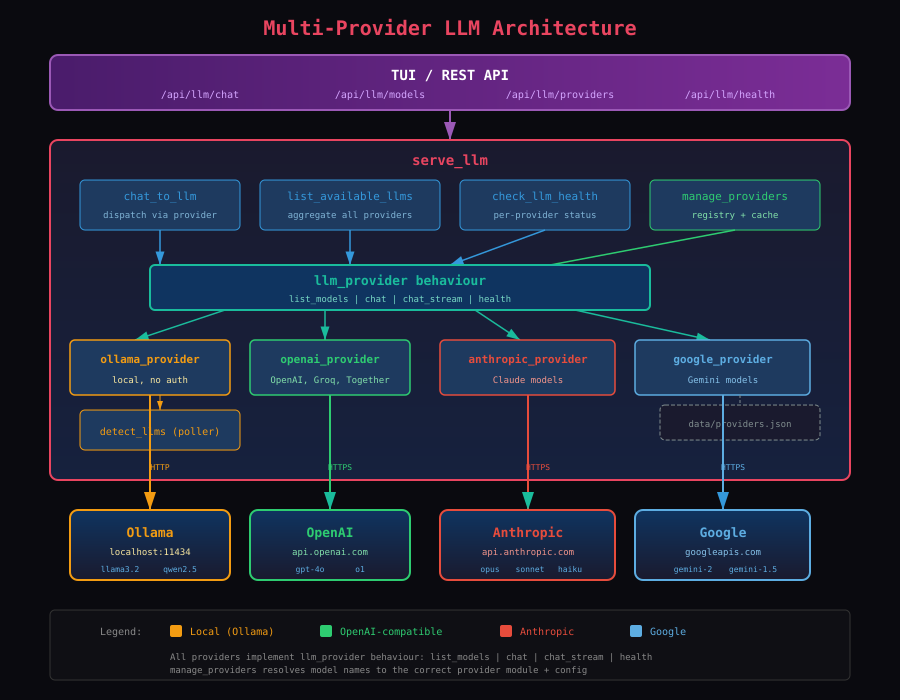
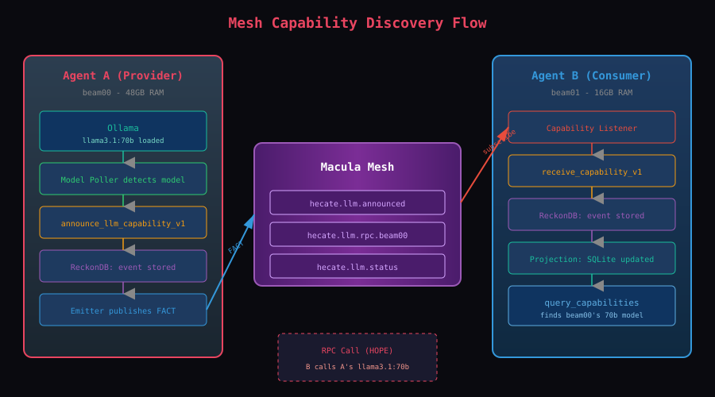

# LLM Service Guide

The `serve_llm` application provides multi-provider LLM inference capabilities. It supports local inference via Ollama and commercial APIs (OpenAI, Anthropic Claude, Google Gemini) through a unified provider abstraction.

## Architecture



### Provider Abstraction

All LLM providers implement the `llm_provider` behaviour with four callbacks:

| Callback | Purpose |
|----------|---------|
| `list_models/1` | List available models from this provider |
| `chat/4` | Synchronous chat completion |
| `chat_stream/6` | Streaming chat completion (SSE) |
| `health/1` | Check provider connectivity |

### Supported Providers

| Provider | Module | Auth | Notes |
|----------|--------|------|-------|
| Ollama | `ollama_provider` | None (local) | Default, always present |
| OpenAI | `openai_provider` | Bearer token | Also works with Groq, Together |
| Anthropic | `anthropic_provider` | x-api-key | Claude models |
| Google | `google_provider` | API key in URL | Gemini models |

### Provider Registry

`manage_providers` is a gen_server that:
- Persists provider configurations to `data/providers.json`
- Resolves model names to the correct provider module
- Caches model-to-provider mappings (5-minute TTL)
- Ensures Ollama is always present as the default provider

## Components

### llm_provider

The behaviour module that defines the provider contract. Also exports `provider_module/1` for mapping type atoms to implementation modules.

### ollama_provider

Local inference via Ollama HTTP API. Extracted from the original `chat_to_llm`, `list_available_llms`, and `check_llm_health` modules.

- Uses NDJSON streaming for `chat_stream`
- URL configurable via `OLLAMA_HOST` env or app config
- No authentication required

### openai_provider

OpenAI-compatible provider. Works with any API that follows the OpenAI chat completions format:
- OpenAI (`api.openai.com`)
- Groq (`api.groq.com/openai`)
- Together (`api.together.xyz`)

Uses SSE streaming format (`data: {...}\n\n`).

### anthropic_provider

Anthropic Messages API for Claude models. Hardcoded model list (Anthropic has no public list-models endpoint):
- `claude-opus-4-5-20251101`
- `claude-sonnet-4-5-20250929`
- `claude-haiku-3-5-20241022`

Handles the Anthropic-specific `system` message extraction (separate top-level field) and SSE event types (`content_block_delta`, `message_delta`, `message_stop`).

### google_provider

Google Gemini (Generative AI) API. Converts between the standard `messages` format and Gemini's `contents`/`parts` structure. Maps `assistant` role to `model` role.

### manage_providers

Gen_server that manages provider configuration:

```erlang
manage_providers:list()                    %% List all providers
manage_providers:add(Name, Type, Config)   %% Add a provider
manage_providers:remove(Name)              %% Remove a provider
manage_providers:provider_for_model(Model) %% Resolve model → {Module, Config}
manage_providers:refresh_models()          %% Invalidate model cache
```

### chat_to_llm

Dispatches chat requests to the appropriate provider:

```erlang
%% Automatically resolves model to correct provider
chat_to_llm:chat(<<"claude-sonnet-4-5-20250929">>, Messages, Opts).
%% → anthropic_provider:chat(Config, Model, Messages, Opts)

chat_to_llm:chat(<<"llama3.2">>, Messages, Opts).
%% → ollama_provider:chat(Config, Model, Messages, Opts)
```

### detect_llms

Polls only local (Ollama) providers for model changes. API-based providers are not polled — their models are listed on demand.

## REST API

### GET /api/llm/models

List available models from all enabled providers.

**Response:**
```json
{
  "ok": true,
  "models": [
    {
      "name": "llama3.2:latest",
      "family": "llama",
      "parameter_size": "3B",
      "context_length": 4096,
      "provider": "ollama"
    },
    {
      "name": "claude-sonnet-4-5-20250929",
      "family": "claude",
      "context_length": 200000,
      "provider": "anthropic"
    },
    {
      "name": "gpt-4o",
      "family": "openai",
      "provider": "openai"
    }
  ]
}
```

### POST /api/llm/chat

Run chat completion. The model is automatically routed to the correct provider.

**Request:**
```json
{
  "model": "claude-sonnet-4-5-20250929",
  "messages": [
    {"role": "system", "content": "You are helpful."},
    {"role": "user", "content": "Hello!"}
  ],
  "stream": false,
  "max_tokens": 1024,
  "temperature": 0.7
}
```

**Response:**
```json
{
  "ok": true,
  "response": {
    "content": "Hello! How can I help you today?",
    "model": "claude-sonnet-4-5-20250929",
    "done": true,
    "eval_count": 15,
    "prompt_eval_count": 8
  }
}
```

**Streaming:** Set `stream: true` for Server-Sent Events (SSE) streaming. All providers normalize to the same SSE format:

```
data: {"content":"Hello","done":false}
data: {"content":"!","done":false}
data: {"content":"","done":true,"model":"claude-sonnet-4-5-20250929","usage":{"prompt_tokens":8,"completion_tokens":15}}
data: [DONE]
```

### GET /api/llm/health

Check health of all configured providers.

**Response:**
```json
{
  "ok": true,
  "status": "healthy",
  "providers": {
    "ollama": "healthy",
    "anthropic": "healthy",
    "openai": "unauthorized"
  }
}
```

### GET /api/llm/providers

List configured providers.

**Response:**
```json
{
  "ok": true,
  "providers": {
    "ollama": {"type": "ollama", "enabled": true, "url": "http://localhost:11434"},
    "anthropic": {"type": "anthropic", "enabled": true, "url": "https://api.anthropic.com"}
  }
}
```

### POST /api/llm/providers/add

Add a new provider.

**Request:**
```json
{
  "name": "anthropic",
  "type": "anthropic",
  "api_key": "sk-ant-api03-...",
  "url": "https://api.anthropic.com"
}
```

**Response:**
```json
{"ok": true}
```

### POST /api/llm/providers/:name/remove

Remove a provider. Ollama cannot be removed.

**Response:**
```json
{"ok": true}
```

## TUI Commands

### /provider

```
/provider                        List configured providers with status
/provider add <type> <api-key>   Add a provider with smart defaults
/provider remove <name>          Remove a provider
```

**Type shortcuts with auto-configuration:**

| Type | Provider Name | API Type | Default URL |
|------|--------------|----------|-------------|
| `anthropic` | anthropic | anthropic | api.anthropic.com |
| `openai` | openai | openai | api.openai.com |
| `google` | google | google | googleapis.com |
| `groq` | groq | openai | api.groq.com/openai |
| `together` | together | openai | api.together.xyz |

**Quick setup:**
```
/provider add anthropic sk-ant-api03-...
/models                          # Shows Ollama + Claude models
/model claude-sonnet-4-5-20250929
Hello!                           # Streams from Anthropic API
```

### /models

Models now show provider badges:

```
Available Models

  llama3.2         (3B) — llama    [ollama]
  claude-sonnet-4-5-20250929  — claude   [anthropic]
  gpt-4o           — openai          [openai]

  Use /model <name> to switch
```

## Mesh Integration



### Capability Announcement

When a new model is detected, the daemon publishes a FACT to the mesh:

**Topic:** `hecate.llm.announced`

**Payload:**
```erlang
#{
    mri => <<"mri:capability:io.macula/hecate-beam00/llm/llama3.1:70b">>,
    type => <<"llm">>,
    model => #{
        name => <<"llama3.1:70b">>,
        context_length => 131072,
        quantization => <<"q4_K_M">>,
        parameter_count => <<"70B">>,
        family => <<"llama">>
    },
    announced_at => 1738590000
}
```

### Mesh Topics

| Topic | Purpose |
|-------|---------|
| `hecate.llm.announced` | Capability announcements |
| `hecate.llm.retracted` | Capability removals |
| `hecate.llm.status` | Status heartbeats |
| `hecate.llm.rpc.*` | RPC requests |

## Configuration

### Environment Variables

| Variable | Purpose | Default |
|----------|---------|---------|
| `OLLAMA_HOST` | Override Ollama URL | `http://localhost:11434` |

### Provider Persistence

Provider configurations are persisted to `data/providers.json`:

```json
{
  "ollama": {"type": "ollama", "enabled": true, "url": "http://localhost:11434"},
  "anthropic": {"type": "anthropic", "enabled": true, "url": "https://api.anthropic.com", "api_key": "sk-ant-..."}
}
```

## Vertical Slices

```
apps/serve_llm/src/
├── serve_llm_app.erl
├── serve_llm_sup.erl
├── llm_provider.erl                    # Provider behaviour
├── ollama_provider.erl                 # Ollama implementation
├── openai_provider.erl                 # OpenAI-compatible implementation
├── anthropic_provider.erl              # Anthropic Claude implementation
├── google_provider.erl                 # Google Gemini implementation
├── manage_providers/
│   └── manage_providers.erl            # Provider registry gen_server
├── chat_to_llm/
│   ├── chat_to_llm.erl                # Chat dispatch
│   └── chat_to_llm_responder.erl      # Mesh responder
├── list_available_llms/
│   ├── list_available_llms.erl         # Model aggregation
│   └── list_available_llms_responder.erl
├── check_llm_health/
│   ├── check_llm_health.erl           # Multi-provider health
│   └── check_llm_health_responder.erl
├── detect_llms/
│   ├── detect_llms.erl                # Local-only poller
│   ├── llm_detected_v1.erl
│   └── llm_removed_v1.erl
└── report_llm_status/
    ├── report_llm_status.erl
    └── llm_status_reported_v1.erl
```

## Testing

```bash
rebar3 eunit --app=serve_llm
```

## Example: Multi-Provider Routing

```
/provider add anthropic sk-ant-...
/provider add openai sk-...

/models
  llama3.2              (3B) — llama     [ollama]
  claude-sonnet-4-5     —    — claude    [anthropic]
  gpt-4o                —    — openai    [openai]

/model claude-sonnet-4-5-20250929
> Analyze this code...          → Routes to Anthropic API

/model llama3.2
> Quick question...             → Routes to local Ollama

/model gpt-4o
> Write a poem...               → Routes to OpenAI API
```
