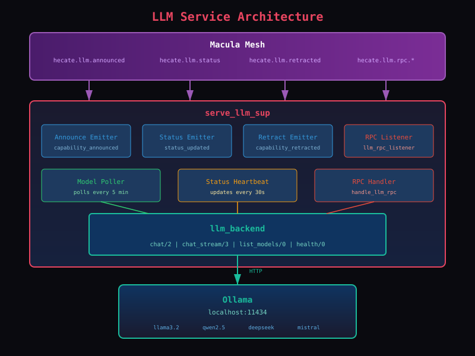

# LLM Service Guide

The `serve_llm` application provides local LLM inference capabilities and mesh-based capability discovery. It enables agents to announce their LLM capabilities to the network and handle inference requests from other agents.

## Architecture



### Mesh Topics

| Topic | Purpose |
|-------|---------|
| `hecate.llm.announced` | Capability announcements |
| `hecate.llm.retracted` | Capability removals |
| `hecate.llm.status` | Status heartbeats |
| `hecate.llm.rpc.{agent}` | RPC requests |

## Components

### llm_backend

The core HTTP client that communicates with Ollama.

**Functions:**
- `chat/2,3` - Synchronous chat completion
- `chat_stream/3` - Streaming chat (sends chunks to caller process)
- `list_models/0,1` - List available models
- `health/0,1` - Health check

**Example:**
```erlang
Messages = [#{role => <<"user">>, content => <<"Hello!">>}],
Opts = #{model => <<"llama3.2">>, temperature => 0.7},
{ok, Response} = llm_backend:chat(Messages, Opts),
Content = maps:get(content, Response).
```

### llm_model_poller

Periodically polls Ollama for available models and dispatches commands to announce/retract capabilities.

- Polls on startup
- Polls every 5 minutes
- Dispatches `announce_llm_capability_v1` for new models
- Dispatches `retract_llm_capability_v1` for removed models

### llm_status_heartbeat

Sends periodic status updates to the mesh.

- Updates every 30 seconds
- Tracks:
  - `queue_depth` - requests waiting
  - `avg_tokens_per_sec` - inference speed
  - `available` - model loaded and ready

### llm_rpc_listener

Listens for incoming RPC requests from other agents via the mesh.

**Subscribed Topic:** `hecate.llm.rpc.{agent-path}`

**Supported Actions:**
- `chat` - Run inference
- `list_models` - List available models
- `health` - Health check

## REST API

### GET /api/llm/models

List available models from local Ollama.

**Response:**
```json
{
  "ok": true,
  "models": [
    {
      "name": "llama3.2:latest",
      "size": 2000000000,
      "modified_at": "2024-01-15T10:30:00Z"
    }
  ]
}
```

### POST /api/llm/chat

Run chat completion.

**Request:**
```json
{
  "model": "llama3.2",
  "messages": [
    {"role": "user", "content": "Hello!"}
  ],
  "stream": false
}
```

**Response:**
```json
{
  "ok": true,
  "content": "Hello! How can I help you today?",
  "model": "llama3.2",
  "eval_count": 15
}
```

**Streaming:** Set `stream: true` for Server-Sent Events (SSE) streaming.

### GET /api/llm/health

Check Ollama backend status.

**Response:**
```json
{
  "ok": true,
  "status": "healthy"
}
```

## Mesh Integration


### Capability Announcement

When a new model is detected, the daemon publishes a FACT to the mesh:

**Topic:** `hecate.llm.announced`

**Payload:**
```erlang
#{
    mri => <<"mri:capability:io.macula/hecate-beam00/llm/llama3.1:70b">>,
    type => <<"llm">>,
    model => #{
        name => <<"llama3.1:70b">>,
        context_length => 131072,
        quantization => <<"q4_K_M">>,
        parameter_count => <<"70B">>,
        family => <<"llama">>
    },
    hardware => #{
        ram_gb => 48,
        cpu_cores => 8,
        gpu => <<"none">>,
        gpu_vram_gb => 0,
        storage_path => <<"/bulk0">>
    },
    status => #{
        queue_depth => 0,
        avg_tokens_per_sec => 45.2,
        available => true
    },
    announced_at => 1738590000
}
```

### Status Updates

Periodic status updates are published as FACTs:

**Topic:** `hecate.llm.status`

**Payload:**
```erlang
#{
    mri => <<"mri:capability:io.macula/hecate-beam00/llm/llama3.1:70b">>,
    status => #{
        queue_depth => 2,
        avg_tokens_per_sec => 42.5,
        available => true
    },
    updated_at => 1738590030
}
```

### RPC Handling

Other agents can call LLM capabilities via mesh RPC:

**Topic:** `hecate.llm.rpc.{agent-path}`

**Request (HOPE):**
```erlang
#{
    <<"request_id">> => <<"rpc-abc123">>,
    <<"action">> => <<"chat">>,
    <<"model">> => <<"llama3.2">>,
    <<"messages">> => [#{<<"role">> => <<"user">>, <<"content">> => <<"Hello">>}],
    <<"reply_to">> => <<"response.topic.xyz">>
}
```

**Response (FEEDBACK):**
```erlang
#{
    <<"request_id">> => <<"rpc-abc123">>,
    <<"status">> => <<"ok">>,
    <<"result">> => #{
        content => <<"Hello! How can I help?">>,
        model => <<"llama3.2">>,
        eval_count => 12
    }
}
```

## Configuration

### sys.config

```erlang
{serve_llm, [
    {enabled, true},
    {backend, ollama},
    {ollama_url, "http://localhost:11434"}
]},

{hecate, [
    {hardware, [
        {ram_gb, 16},
        {cpu_cores, 4},
        {gpu, <<"none">>},
        {gpu_vram_gb, 0},
        {storage_path, <<"/bulk0">>}
    ]}
]}
```

### Environment Variables

- `OLLAMA_HOST` - Override Ollama URL (useful for Docker)

## Vertical Slices

The service follows vertical slicing architecture:

```
apps/serve_llm/src/
├── serve_llm_app.erl
├── serve_llm_sup.erl
├── llm_backend/
│   └── llm_backend.erl
├── announce_llm_capability/
│   ├── announce_llm_capability_v1.erl
│   ├── llm_capability_announced_v1.erl
│   ├── maybe_announce_llm_capability.erl
│   └── llm_capability_announced_v1_to_mesh.erl
├── retract_llm_capability/
│   ├── retract_llm_capability_v1.erl
│   ├── llm_capability_retracted_v1.erl
│   ├── maybe_retract_llm_capability.erl
│   └── llm_capability_retracted_v1_to_mesh.erl
├── update_llm_status/
│   ├── update_llm_status_v1.erl
│   ├── llm_status_updated_v1.erl
│   ├── maybe_update_llm_status.erl
│   ├── llm_status_updated_v1_to_mesh.erl
│   └── llm_status_heartbeat.erl
├── poll_llm_models/
│   └── llm_model_poller.erl
└── handle_llm_rpc/
    ├── llm_rpc_listener.erl
    └── handle_llm_rpc.erl
```

## Testing

Run LLM-specific tests:
```bash
rebar3 eunit --app=serve_llm
```

## Example: Multi-Node LLM Routing

```
beam00 (48GB) → llama3.1:70b   [queue:0, 45 tok/s]
beam01 (16GB) → llama3.2:3b    [queue:2, 120 tok/s]
beam02 (16GB) → qwen2.5-coder  [queue:0, 80 tok/s]
beam03 (16GB) → deepseek-r1    [queue:1, 60 tok/s]

Request: "I need code help, fast"
→ Routes to beam02 (coder model, no queue)

Request: "Analyze this 50k token document"
→ Routes to beam00 (only one with 128k context)
```
