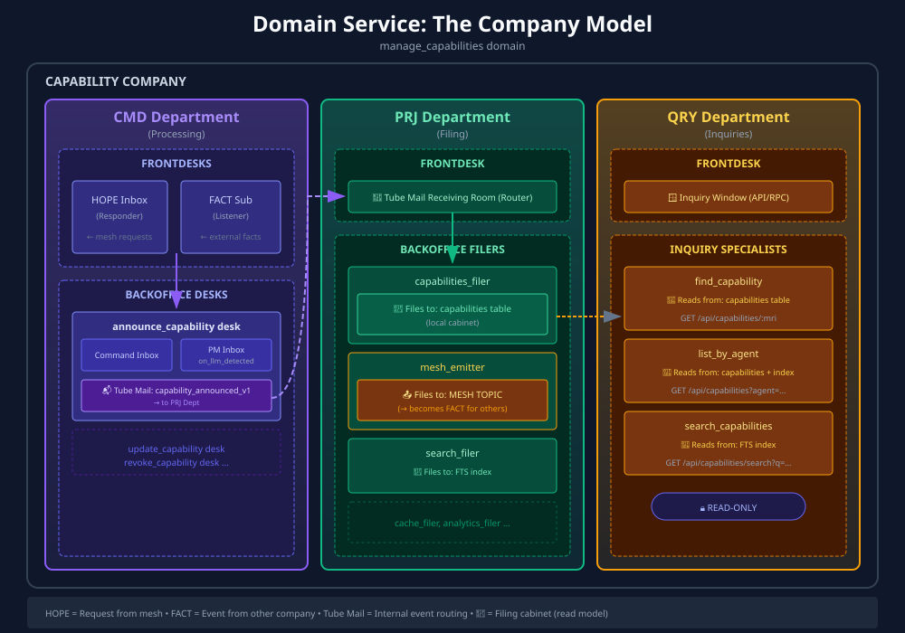

# Division Architecture: The Division Model

> *Note: "Cartwheel" is the historical name for what is now called "Division Architecture".*

> A mental model for understanding domain services as small specialized divisions.



## Overview

Think of each **Domain Service** as a small division that specializes in one business process. This division has three departments:

| Department | Role | Analogy |
|------------|------|---------|
| **CMD** | Processing | Operations — receives requests, processes dossiers, adds event slips |
| **PRJ** | Filing | Records — maintains filing cabinets (read models) from event slips |
| **QRY** | Inquiries | Customer Service — answers questions by reading from filing cabinets |

Each department has **frontdesks** (public-facing) and **backoffice desks** (internal processing).

---

## The Division Structure

```
┌─────────────────────────────────────────────────────────────────────────┐
│                       CAPABILITY DIVISION                               │
│                   (manage_capabilities domain)                          │
├───────────────────────┬───────────────────────┬─────────────────────────┤
│      CMD Dept         │       PRJ Dept        │        QRY Dept         │
│     (Processing)      │       (Filing)        │       (Inquiries)       │
├───────────────────────┼───────────────────────┼─────────────────────────┤
│ Frontdesks:           │ Frontdesk:            │ Frontdesk:              │
│ • HOPE inbox          │ • Event router        │ • Inquiry window        │
│ • FACT subscription   │                       │   (API/RPC)             │
│                       │                       │                         │
│ Backoffice:           │ Backoffice:           │ Backoffice:             │
│ • announce desk       │ • capabilities filer  │ • find_capability       │
│ • update desk         │ • search index filer  │ • list_by_agent         │
│ • revoke desk         │ • mesh emitter        │ • search                │
└───────────────────────┴───────────────────────┴─────────────────────────┘
```

---

## CMD Department (Processing)

The CMD department handles all incoming work and processes dossiers.

### Frontdesks (Public-Facing)

Frontdesks are the entry points for external communication:

**HOPE Inbox (Responder)**
- Receives requests from the mesh (other divisions)
- Records the reception
- Translates HOPE → internal Command
- Passes to appropriate backoffice desk

**FACT Subscription (Listener)**
- Subscribes to events from other divisions
- Receives external FACTs
- Translates FACT → internal Command
- Passes to appropriate backoffice desk

```
┌─────────────────────────────────────────┐
│           CMD FRONTDESKS                │
├─────────────────────────────────────────┤
│  ┌─────────────┐    ┌─────────────┐     │
│  │ HOPE Inbox  │    │ FACT Sub    │     │
│  │ (Responder) │    │ (Listener)  │     │
│  └──────┬──────┘    └──────┬──────┘     │
│         │                  │            │
│         └────────┬─────────┘            │
│                  ↓                      │
│         [To Backoffice]                 │
└─────────────────────────────────────────┘
```

### Backoffice Desks (Internal Processing)

Each backoffice desk handles a specific action on dossiers:

**Inboxes (multiple per desk):**
1. **Command Inbox** — receives commands from frontdesk or internal callers
2. **Policy/PM Inboxes** — subscribed to internal events (reactive triggers)

**Outboxes (tube mail):**
- One tube per event type the desk can emit
- Sends dossier + new slip to PRJ department

```
┌─────────────────────────────────────────────────────────────────┐
│                 ANNOUNCE_CAPABILITY DESK                        │
├─────────────────────────────────────────────────────────────────┤
│  INBOXES:                                                       │
│  ┌──────────────────┐  ┌─────────────────────────────────────┐  │
│  │ Command Inbox    │  │ PM Inbox: on_llm_model_detected     │  │
│  │ (happy path)     │  │ (policy trigger)                    │  │
│  └────────┬─────────┘  └────────┬────────────────────────────┘  │
│           │                     │                               │
│           └──────────┬──────────┘                               │
│                      ↓                                          │
│           ┌──────────────────┐                                  │
│           │ Process Command  │                                  │
│           │ • Validate       │                                  │
│           │ • Add slip       │                                  │
│           └────────┬─────────┘                                  │
│                    ↓                                            │
│  TUBE MAIL OUTBOX:                                              │
│  ┌──────────────────────────────────────┐                       │
│  │ capability_announced_v1 ────────────────→ [To PRJ Dept]      │
│  └──────────────────────────────────────┘                       │
└─────────────────────────────────────────────────────────────────┘
```

---

## PRJ Department (Filing)

The PRJ department maintains filing cabinets (read models) from event slips.

### Frontdesk (Event Router)

- Tube mail receiving room
- Collects all incoming event tubes from CMD
- Routes slips to appropriate filing desks

### Backoffice Desks (Filers)

Each desk maintains specific filing cabinets:

**Regular Filers** — update local cabinets (SQLite tables)
- `capability_announced_to_capabilities` — files to capabilities table
- `capability_announced_to_search` — files to FTS index

**Emitter Filers** — file to external destinations (mesh)
- `capability_announced_to_mesh` — "files" to mesh topic
- This is how our events become FACTs for other divisions

```
┌─────────────────────────────────────────────────────────────────┐
│                      PRJ DEPARTMENT                             │
├─────────────────────────────────────────────────────────────────┤
│  FRONTDESK (Event Router):                                      │
│  ┌──────────────────────────────────────┐                       │
│  │ Tube Mail Receiving Room             │                       │
│  │ ← capability_announced_v1            │                       │
│  │ ← capability_updated_v1              │                       │
│  │ ← capability_revoked_v1              │                       │
│  └────────────────┬─────────────────────┘                       │
│                   ↓                                             │
│  BACKOFFICE (Filers):                                           │
│  ┌────────────────────────┐  ┌────────────────────────┐         │
│  │ capabilities_filer     │  │ mesh_emitter           │         │
│  │                        │  │                        │         │
│  │ Files to:              │  │ Files to:              │         │
│  │ [capabilities table]   │  │ [MESH TOPIC]           │         │
│  │ (local cabinet)        │  │ (external division)    │         │
│  └────────────────────────┘  └────────────────────────┘         │
└─────────────────────────────────────────────────────────────────┘
```

### Key Insight: Emitters ARE Filers

An emitter is just a filing desk that files to an external destination instead of a local cabinet:

| Filer Type | Destination | Purpose |
|------------|-------------|---------|
| Regular | SQLite table | Query optimization |
| Cache | ETS/Redis | Hot data access |
| Search | FTS index | Full-text search |
| **Emitter** | **Mesh topic** | **External integration** |

The pattern is identical — receive event, transform, write to destination.

---

## QRY Department (Inquiries)

The QRY department answers questions by reading from filing cabinets.

### Frontdesk (Inquiry Window)

- Public-facing counter
- Receives queries via HTTP API or mesh RPC
- Routes to appropriate specialist desk

### Backoffice Desks (Inquiry Specialists)

Each desk answers specific questions:

- `find_capability` — looks up single capability by MRI
- `list_by_agent` — lists capabilities for an agent
- `search_capabilities` — searches FTS index

**Important:** QRY desks are **read-only**. They never modify cabinets or emit events.

```
┌─────────────────────────────────────────────────────────────────┐
│                      QRY DEPARTMENT                             │
├─────────────────────────────────────────────────────────────────┤
│  FRONTDESK (Inquiry Window):                                    │
│  ┌──────────────────────────────────────┐                       │
│  │ ← GET /api/capabilities/:mri         │                       │
│  │ ← GET /api/capabilities?agent=...    │                       │
│  │ ← mesh RPC: capabilities.find        │                       │
│  └────────────────┬─────────────────────┘                       │
│                   ↓                                             │
│  BACKOFFICE (Specialists):                                      │
│  ┌────────────────────────┐  ┌────────────────────────┐         │
│  │ find_capability        │  │ list_by_agent          │         │
│  │                        │  │                        │         │
│  │ Reads from:            │  │ Reads from:            │         │
│  │ [capabilities table]   │  │ [capabilities table]   │         │
│  └────────────────────────┘  └────────────────────────┘         │
└─────────────────────────────────────────────────────────────────┘
```

---

## Complete Flow: Three Entry Points

### 1. External HOPE (Request from another division)

```
External HOPE arrives
    ↓
CMD Frontdesk [Responder]
    • Receives HOPE
    • Translates to Command
    ↓
CMD Backoffice [Desk]
    • Validates
    • Adds slip to dossier
    ↓
Tube Mail
    ↓
PRJ Frontdesk [Router]
    ↓
PRJ Backoffice [Filers]
    • Update local cabinets
    • Emit to mesh (becomes FACT for others)
```

### 2. External FACT (Event from another division)

```
External FACT arrives
    ↓
CMD Frontdesk [Listener]
    • Receives FACT
    • Translates to Command
    ↓
CMD Backoffice [Desk]
    • Validates
    • Adds slip to dossier
    ↓
Tube Mail
    ↓
PRJ Department...
```

### 3. Internal Policy Trigger

```
Internal Event occurs
    ↓
CMD Backoffice [PM Inbox]
    • Receives event
    • Creates Command
    ↓
CMD Backoffice [Desk]
    • Validates
    • Adds slip to dossier
    ↓
Tube Mail
    ↓
PRJ Department...
```

### 4. External Query

```
Query arrives
    ↓
QRY Frontdesk [API]
    • Receives query
    • Routes to specialist
    ↓
QRY Backoffice [Specialist]
    • Reads from cabinet
    • Returns answer
```

---

## Mapping to Code

| Division Concept | Code Artifact |
|------------------|---------------|
| Division | Domain app (`manage_capabilities`) |
| CMD Department | `manage_capabilities_sup` children |
| PRJ Department | `query_capabilities_sup` children |
| QRY Department | `query_capabilities.erl` + store |
| Frontdesk (HOPE) | `*_responder_v1.erl` |
| Frontdesk (FACT) | `*_listener.erl` |
| Backoffice Desk | `*_desk_sup` + handler |
| Command Inbox | `maybe_*.erl` handle/1 |
| PM Inbox | `on_*_maybe_*.erl` |
| Tube Mail | Event published to store |
| Filing Cabinet | SQLite table |
| Emitter Filer | `*_to_mesh.erl` |

---

## Why This Model Helps

1. **Clear responsibilities** — Each desk has one job
2. **Obvious data flow** — Dossiers flow through tube mail
3. **Natural boundaries** — Departments don't share internal state
4. **Testable units** — Each desk can be tested in isolation
5. **Maps to supervision** — Departments are supervisors, desks are workers

---

## See Also

- [CARTWHEEL_OVERVIEW.md](CARTWHEEL_OVERVIEW.md) — High-level architecture
- [CARTWHEEL_WRITE_SEQUENCE.md](CARTWHEEL_WRITE_SEQUENCE.md) — CMD department details
- [CARTWHEEL_PROJECTION_SEQUENCE.md](CARTWHEEL_PROJECTION_SEQUENCE.md) — PRJ department details
- [CARTWHEEL_QUERY_SEQUENCE.md](CARTWHEEL_QUERY_SEQUENCE.md) — QRY department details
- [DDD.md](../../DDD.md) — The Dossier Principle

---

*The division processes dossiers. Each desk adds its slip. The filing cabinets remember everything.*
